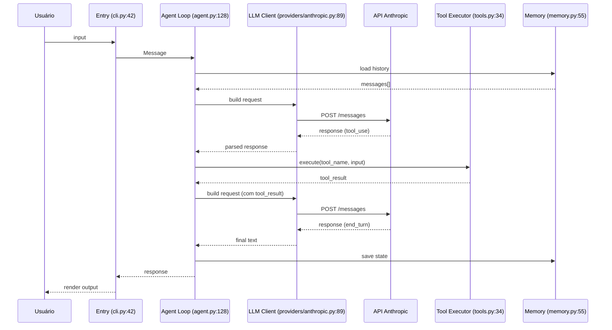

# Dossier Template — O documento final da investigação

Use este template como entrega da Fase 6. Salve como `docs/investigation.md` na sua cópia local do projeto.

Cada seção tem uma explicação do que entra ali. Preencha ao longo da investigação.

---

```markdown
# Dossiê: <NomeDoProjeto>

> Investigação realizada em <data>
> Versão do projeto: <commit hash ou tag>
> Tempo total de investigação: <horas>

---

## 1. Identidade

| Atributo | Valor |
|---|---|
| Tipo principal | <CLI / HTTP server / library / multi> |
| Linguagem | <Python / TypeScript / Rust / Go> |
| Framework de agente | <nenhum / langgraph / pydantic-ai / crewai / custom> |
| SDK LLM | <anthropic / openai / litellm / google-genai> |
| Vector store | <pgvector / chromadb / faiss / qdrant / none> |
| Observabilidade nativa | <langfuse / langsmith / otel / nenhuma> |
| Tamanho | <N arquivos relevantes (excluindo testes e geração)> |
| Stars no GitHub | <N> |
| Licença | <MIT / Apache 2.0 / outra> |

---

## 2. Entry point

- **Arquivo:** `<path/to/file.py>`
- **Função:** `<nome_da_funcao>`
- **Linha:** `<N>`
- **Tipo:** <CLI / HTTP route / library entry>
- **Comando para invocar:**
  ```bash
  <comando exemplo>
  ```
- **Como o input é recebido:** <stdin / args / HTTP body / WebSocket message>
- **Formato esperado:** <string pura / dict / objeto estruturado>

---

## 3. Os 6 componentes universais

### 3.1 Agent loop
- **Arquivo:linha:** `<path>:<N>`
- **Tipo:** <ReAct / Plan-Execute / StateGraph / custom while-loop>
- **Condição de parada:** <descrição>
- **Max iterations:** <N>
- **Há recovery de erro de tool dentro do loop:** <sim/não, como>

### 3.2 LLM Client
- **Arquivo:linha:** `<path>:<N>`
- **Provider:** <Anthropic / OpenAI / multi via LiteLLM>
- **Modelo default:** `<nome-do-modelo-versao>`
- **Suporta múltiplos providers:** <sim/não>
- **Streaming:** <sim/não>
- **Retry policy:** <exponential backoff / tenacity / nenhuma>
- **Fallback entre modelos:** <sim/não, como>

### 3.3 Tool Registry
- **Arquivo:linha:** `<path>:<N>`
- **Padrão de registro:** <@tool decorator / lista manual / discovery via manifest>
- **Quantidade total de tools:** <N>
- **Tipo de invocação:** <function calling nativo / structured output / XML tags>
- **Validação de input:** <Pydantic / JSON Schema / sem validação>
- **Tools mais críticas para o fluxo:**
  - `<nome_tool_1>` — <o que faz>
  - `<nome_tool_2>` — <o que faz>
  - `<nome_tool_3>` — <o que faz>

### 3.4 Memory / State
- **Arquivo:linha:** `<path>:<N>`
- **Memória de curto prazo:** <messages array em memória / state object / outro>
- **Memória de longo prazo:** <vector store qual / nenhuma>
- **Persistência entre sessões:** <sim/não, como>
- **Checkpoint/resume:** <sim/não, como>

### 3.5 Prompt Manager
- **Arquivo:linha:** `<path>:<N>`
- **System prompt está em:** <arquivo de prompt / hardcoded / template engine>
- **Tamanho aproximado do system prompt:** <N tokens>
- **Prompt muda dinamicamente:** <sim/não, baseado em quê>

### 3.6 Hooks / Middleware
- **Arquivo:linha:** `<path>:<N>` ou "não existe"
- **Pré-LLM:** <descrição ou "não tem">
- **Pós-LLM:** <descrição ou "não tem">
- **Pré-tool:** <descrição ou "não tem">
- **Pós-tool:** <descrição ou "não tem">

---

## 4. Fluxo end-to-end

Diagrama de uma execução típica (mensagem do usuário até resposta final):



Ou em lista numerada:

1. `<arquivo:linha>` — `<o que acontece>`
2. `<arquivo:linha>` — `<o que acontece>`
3. ...

---

## 5. Padrões observados

### Padrão de loop
- Tipo: <ReAct linear / Plan-Execute / Multi-agent supervisor / StateGraph>
- Iterações típicas por tarefa: <curto: 1-3 / médio: 4-8 / longo: 9+>

### Padrão de tool execution
- Paralelismo: <sequencial / paralelo com asyncio / paralelo com threads>
- Timeout por tool: <sim/não, valor>
- Recuperação de erro: <retry / passa erro pro LLM / aborta>

### Padrão de streaming
- Streaming de tokens: <sim/não>
- Streaming de eventos intermediários: <sim/não>
- Como é exposto ao consumidor: <SSE / WebSocket / generator Python>

### Padrão de memória
- Janela de contexto management: <truncamento simples / summary / vector retrieval / hierarquia>
- Quando comprime: <após N tokens / após N mensagens / nunca>

### Padrão de observabilidade
- Logging: <estruturado JSON / print / loguru>
- Tracing: <Langfuse / LangSmith / OTel / nenhum>
- Métricas expostas: <Prometheus / nenhuma>

---

## 6. Métricas observadas (das execuções de teste)

Capture estas métricas durante a Fase 5:

| Métrica | Valor médio |
|---|---|
| System prompt size | <N tokens> |
| Input tokens por turno (média) | <N> |
| Output tokens por turno (média) | <N> |
| Latência por chamada LLM (P50) | <ms> |
| Latência por chamada LLM (P95) | <ms> |
| Iterações por tarefa simples | <N> |
| Iterações por tarefa complexa | <N> |
| Custo estimado por tarefa | <$ ou tokens> |
| Taxa de erro de tools observada | <%> |
| Distribuição de stop_reason | end_turn: X%, tool_use: Y%, outros: Z% |

---

## 7. Pontos de atenção / fragilidades observadas

Anote tudo que pareceu frágil, mal coberto, ou interessante. Exemplos:

- [ ] System prompt hardcoded — difícil de A/B testar
- [ ] Sem retry em chamadas LLM — falha de rede quebra a sessão
- [ ] Tool X aceita input sem validação — risco de prompt injection
- [ ] Loop não tem timeout global — pode rodar para sempre
- [ ] Memória de longo prazo não é deduplicada
- [ ] Sem rate limiting no entry point
- [ ] Streaming não trata desconexão do cliente
- [ ] ...

---

## 8. Decisões arquiteturais notáveis

Coisas que o projeto faz **diferente do óbvio** — e por quê (sua hipótese).

Exemplos de observações que valem documentar:

- "Usa state machine explícita (LangGraph) em vez de while-loop. Hipótese: facilita resume/checkpoint."
- "Tools são definidas como classes, não funções. Hipótese: permite injetar dependências (DB, HTTP client)."
- "System prompt é gerado em runtime concatenando 5 fragmentos. Hipótese: permite ativar capabilities dinamicamente."

---

## 9. Pendências (o que ainda não entendi)

Liste honestamente o que ficou obscuro. Volte aqui em uma segunda rodada de investigação.

- [ ] <pendência 1>
- [ ] <pendência 2>
- [ ] <pendência 3>

---

## 10. Aprendizados transferíveis

O que desse projeto você vai levar para outros projetos? (esta é a parte que importa para crescer como arquiteto)

- **Padrão X que vou usar:** <descrição>
- **Anti-padrão Y que vou evitar:** <descrição>
- **Decisão arquitetural Z que vou considerar:** <descrição>

---

## Anexos

### Anexo A: Comandos para reproduzir a investigação

```bash
# Clone
git clone <url>
cd <projeto>
git checkout <commit que investiguei>

# Setup
<comandos>

# Testes que rodei
<comandos>
```

### Anexo B: Traces salvos

- Trace 1 (teste sem tool): <caminho>
- Trace 2 (teste com tool): <caminho>
- Trace 3 (multi-tool): <caminho>

### Anexo C: Mudanças experimentais que fiz

```diff
- linha original
+ minha mudança experimental
```
Observação: <o que aconteceu>
```

---

## Dicas para preencher

1. **Não tente preencher tudo de uma vez.** O dossiê cresce ao longo das 6 fases.
2. **Cite sempre arquivo:linha.** Sem isso o dossiê fica vago demais para ser útil depois.
3. **Hipóteses são bem-vindas.** Marque-as explicitamente: "Hipótese: ...". Não invente certezas.
4. **Atualize a versão estudada.** Projetos mudam — daqui a 6 meses pode estar tudo diferente.
5. **A seção 10 é a mais importante.** É o que diferencia "estudou um projeto" de "cresceu como arquiteto".

---

## Quando dar a investigação por encerrada

Você terminou quando consegue:

- Apresentar o dossiê para alguém que nunca viu o projeto e ela entender a arquitetura
- Responder 8 de 10 perguntas do "teste final do detetive" sem olhar o código
- Prever o número de iterações que um input vai consumir antes de rodar
- Propor uma modificação no agente e prever o impacto antes de implementar

Caso contrário, há mais investigação a fazer.
